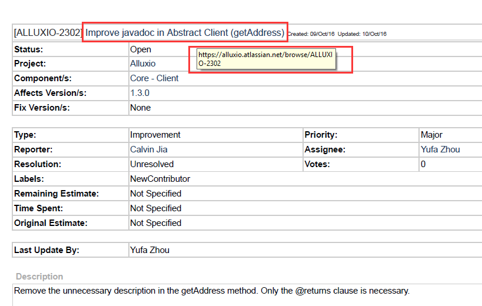

# Pr 任务分配列表

请大家各自独立完成分配给自己的pr任务，完成他人任务不计分哦(*^__^*)

学号未出现在该页面的童鞋，麻烦更新群备注（学号-姓名），并在群里说明下，以便我及时更新。

## 截止日期

第一批截止日期为`2017-05-14 23:59:59`。

第二批截止日期为`2017-06-04 23:59:59`。

#### 注意：所提交PR需要在截止日期前被成功merge才有效！！超过截止日期已提交但没merge的PR无效哦~

#### 由于PR从创建到审核再到最终merge一般需要几个工作日，大家一定要在截止日期之前提前几天提交！！

#### 提交PR后，麻烦在群里发一下自己的PR链接，或者私信`@李崇杰`

## Note

- 大家创建PR时请注意PR的标题格式，标准格式如图所示，已经创建的PR也支持修改标题的。
  
  code improvment任务
  文档修改任务
- pdf中每个任务的标题是一个超链接，点击即可在浏览器中打开，但由于AWS S3故障导致国内无法正常访问，请大家在创建PR时的描述框中，第一行添加该链接，如图所示，
  
  
- 创建PR后，会有个 alluxio-bot 提示你`sign a contribution license agreement`，这个作用是确保你写的代码能够被开源社区接受和使用，烦请大家花两分钟sign下，很简单的(*^__^*)
  
- 在sign contribution license agreement的时候，需要填写相应信息，请将所有信息填写完整，不然可能无法收到邮件，收到邮件后按提示操作即可。

### 第一批（截止日期`2017-05-14 23:59:59`）

| 学号 | issue任务链接 | Pull Request 链接 | merged |
|:---------:|:---------------:|:-------------------------------------------------:|:---:|
| 141220038 | ALLUXIO--2314 | | |
| 151070019 | ALLUXIO-­2320 | | |
| 141220135 | ALLUXIO-­2581 | | |
| 141220075 | ALLUXIO-­2582 | | |
| 151070020 | ALLUXIO-­2583 | | |
| 141220109 | ALLUXIO-­2584 | | |
| 141220155 | ALLUXIO-­2585 | | |
| 141220015 | ALLUXIO-­2344 | | |
| 141220105 | ALLUXIO-­2326 | | |
| 141220043 | ALLUXIO-­2621 | | |
| 141220157 | ALLUXIO-­2616 | | |
| 141220158 | ALLUXIO-­2615 | | |
| 141220161 | ALLUXIO-­2605 | | |
| 141220127 | ALLUXIO-­2630 | | |
| 141220040 | ALLUXIO-­2626 | | |
| 141220070 | ALLUXIO-­2625 | | |
| 141220053 | ALLUXIO-­2624 | | |
| 141220009 | ALLUXIO-­2619 | | |
| 141220162 | ALLUXIO-­2620 | | |
| 141220051 | ALLUXIO-­2623 | | |
| 141220119 | ALLUXIO-­2622 | | |
| 141220140 | ALLUXIO-­2618 | | |
| 141220110 | ALLUXIO-­2617 | | |
| 141220048 | ALLUXIO-­2614 | | |
| 141220067 | ALLUXIO-­2613 | | |
| 141220001 | ALLUXIO-­2612 | | |
| 141220028 | ALLUXIO-­2610 | | |
| 141220062 | ALLUXIO-­2609 | | |
| 141220005 | ALLUXIO-­2608 | | |
| 141220125 | ALLUXIO-­2607 | | |
| 141220060 | ALLUXIO-­2604 | | |
| 141270020 | ALLUXIO-­2591 | | |
| 141220130 | ALLUXIO-­2603 | | |
| 141220035 | ALLUXIO-­2602 | | |
| 141220042 | ALLUXIO-­2601 | | |
| 141220068 | ALLUXIO-­2600 | | |
| 141220139 | ALLUXIO-­2599 | | |
| 141220003 | ALLUXIO-­2598 | | |
| 141220034 | ALLUXIO-­2597 | | |
| 141220138 | ALLUXIO-­2596 | | |
| 141220103 | ALLUXIO-­2595 | | |
| 141220153 | ALLUXIO-­2592 | | |
| 141220100 | ALLUXIO-­2593 | | |
| 141210039 | ALLUXIO-­2590 | | |

### 第二批（截止日期`2017-06-04 23:59:59`，jira任务见**Alluxio-JIRA-List-2.pdf**）

